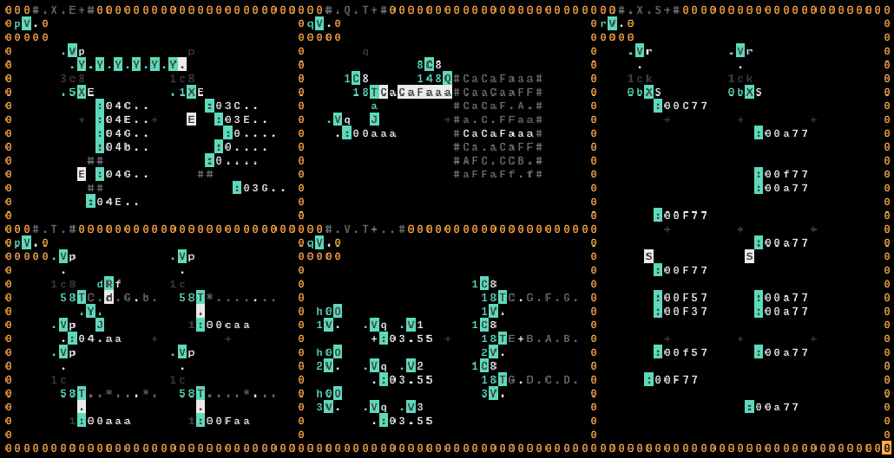

# Examples

These are a collection of ways you might make melodies and rythms. All examples (boxes) have a variable at the top left, where you can give `*` as its value to play the example.

## `X` `E`

When we give `E` as the input to be written with `X` operator, `E` will not immediately fly away, but instead will activate when `X` writes to some other location.
