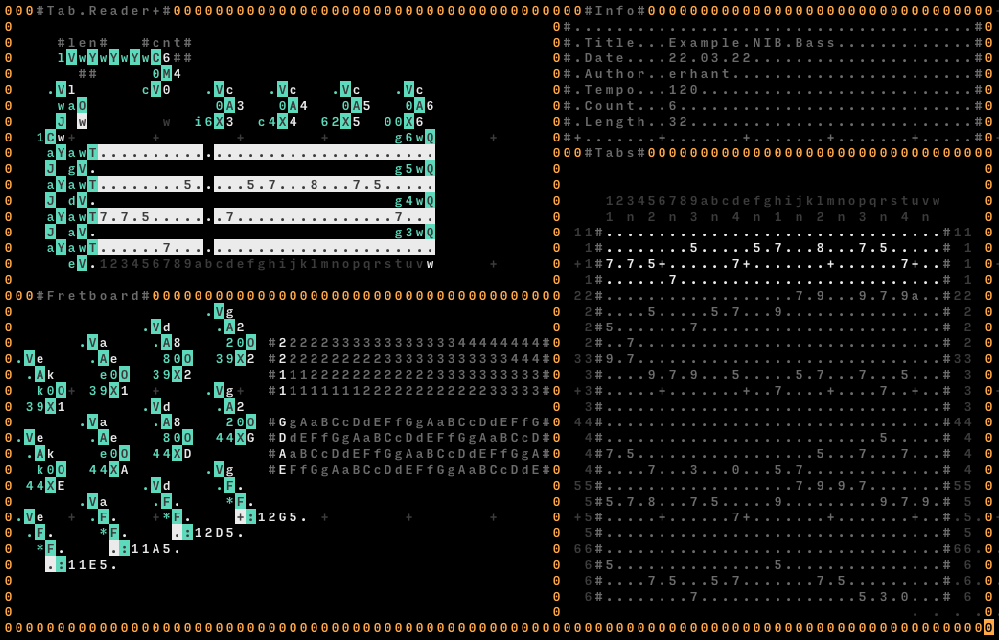

# Fretboard & Tabs

A fretboard implementation in Orca. The given implementation is for a 4-string bass with standard tuning, with 24 frets. A tab-reader is also implemented together with the fretboard.

The example tabs in the picture is a minified-not-that-great version of Geezer Butler's Bass Solo at the start of N.I.B. by Black Sabbath.

## Fretboard

The fretboard is simply a combination of `O` and `X` operators, two for each string. One pair (top) reads the octave and writes it to the octave parameter of `:`, and the other pair (bottom) reads the note and writes it to the note parameter of `:` at the very bottom.

The indexing to read octaves and notes is defined by four variables: `e`, `a`, `d` and `g`, each representing their respective strings' pressed fret. 0 is open string. If no fret is pressed, the variable stores `.`, which is checked below so that no sound is played if that is the case.

I can't help but enjoy how much the left part of the fretboard looks like an actual 4-string bass guitar neck 🖤.

## Tab Reader

The tab reader reads the tab contents in parallel for all strings, one note per frame. The tab length is 32 by default, but can be changed at the upper left (indicated by `#len#`). The current length can be seen visually at the bottom of the tab reader (`w` is highlighted in the picture, as it is 32).

Since each tab is read for 32 (or whatever length you give) frames, after that many frames the next tab rows are retrieved. You can specify how many rows are there by changing the right operand of `C` under `#cnt#` part.

## Tabs

This is where we write the tabs. This implementation only supports notes right now. More advanced notation such as `h`, `p`, or such is not supported.

## Info

This section is just for some visual metadata, such as tempo, tab count and tab length.