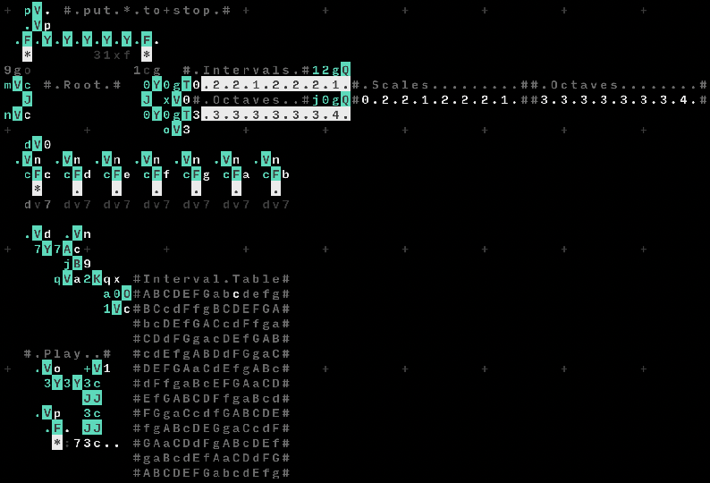

# Scales & Intervals

Orca code to play scales, given their intervals.

The `K` operator is used obtain a table, where given a note and interval, outputs the next note. This note is then fedback to the initial variables via `O`, which allows us to write the intervals as is rather than cummulatively (e.g. `[0, 2, 2, 1, 2, 2, 2, 1]` instead of `[0, 2, 4, 5, 7, 9, b, c]`).

In terms of numbers, Orca does not differentiate uppercase and lowercase numbers. For that, we check if the note is lowercase (sharp) and offset the note value by 7 if true.

To reset, put `*` at the top into `p` variable, and then give whatever root note you would like to the left of `#.Root.#` message.

A collection of scales and octaves can be given to the right. Right now there is only the [Major scale](https://en.wikipedia.org/wiki/Major_scale).
