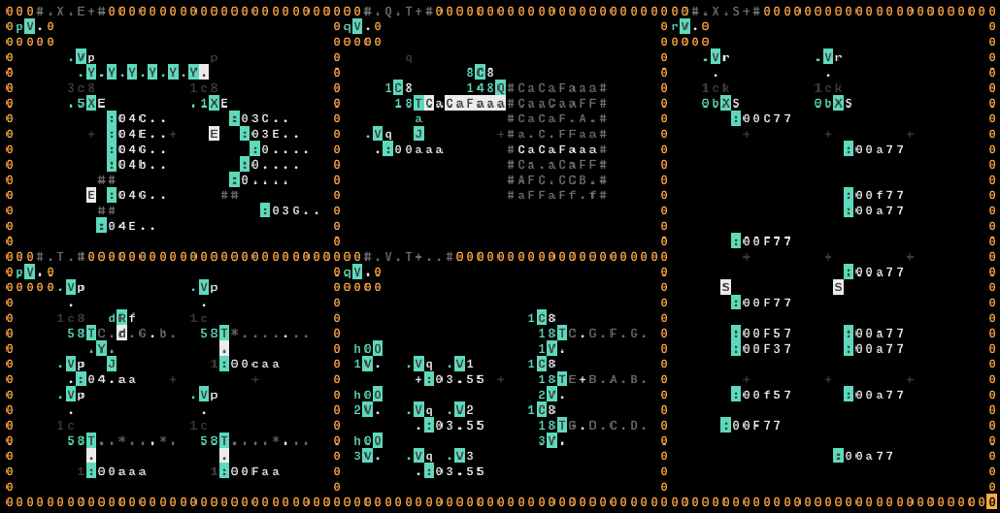
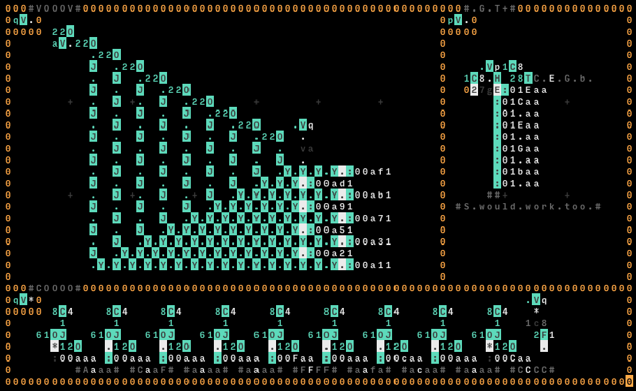

# Sequencing

These are a collection of ways you might make melodies and rythms. All examples (boxes) have a variable at the top left, where you can give `*` as its value to play the example.

- **`T`**: The very basic usage of `T` is to give a sequence of notes or bangs, and play them by iterating over `T` one by one with a clock.
- **`Q T`**: We can join the end of `T` to the `Q` operator, to query specific sequences to be iterated by `T`. This gives us more control on which sequence to play, and is very useful.
- **`V T`**: Instead of using the output of `T` directly, we can pass it to a variable to be accessed somewhere else. This gives us a greater leeway on our spacing.
- **`X` `E`**: When we give `E` as the input to be written with `X` operator, `E` will not immediately fly away, but instead will activate when `X` writes to some other location. We can use this effect to create a _wave_ of `E`s that are stopped by `:` operators. This effectively becomes a sequencer, but there is an added benefit of adjusting the time of beat for each sound. Since `E` moves 1 frame at a time, we can move the `:` a bit more to the right to create a delayed sound. This makes things a bit more dynamic. The second `X` `E` on the right side uses this effect.
- **`X` `S`**: Similar to `X` `E`, we can achieve a sequencing effect with an `X` writing `S`. When the `y` position of `X` is incremented, the `S` written above will bang on top of the newly written `S`. The benefit of delaying the input is not like what is the case for `E`, but we can still delay the last bang; it will only bang where we specify it to bang. The second `X` `S` on the right side uses this effect.

- **`VOOOV`**: A vertical recursion implementation can achieve a sequencing effect. A variable can be used to feedback the top value to the bottom.
- **`COOOO`**: A horizontal recursion implementation can achieve a sequencing effect, perhaps with a bit more leeway. In this example, an `O` is used to select notes similar to `T`. Instead of feeding back the loop using variables at both ends, we can use a clock with a set rate on top of an `F` to bang on specific intervals.
- **`G T`**: A generator `G` can be used to print the actual `:` operations, with a `E` (or `S`) on its left. By changing the print location, `E` is activated and bangs `:`. The notes can be given with `T` to the generator.
